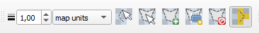
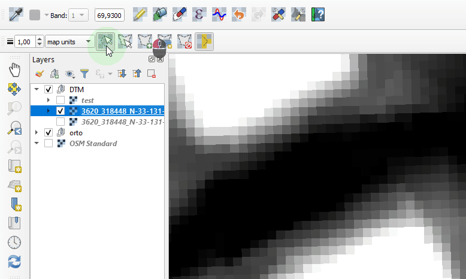
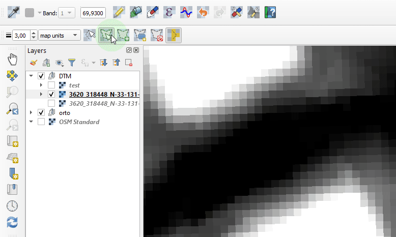
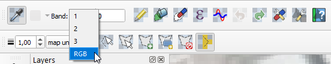
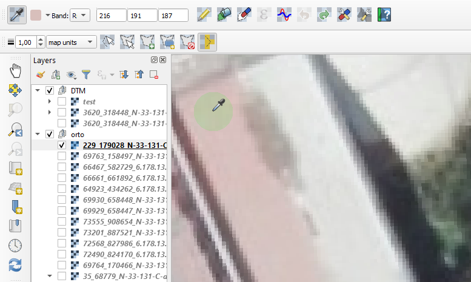
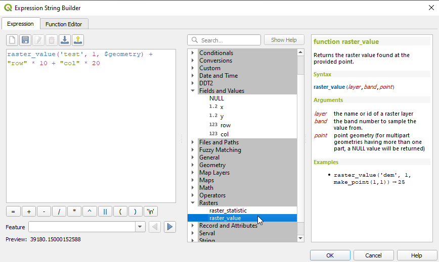
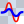
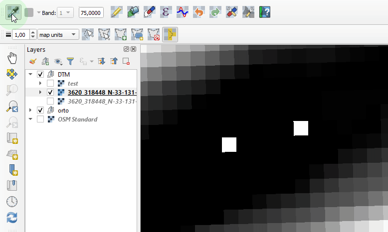
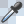

# Serval User Manual

Serval is a QGIS plugin for advanced raster editing and processing. 
It provides comprehensive tools for modifying raster parts and is particularly powerful for elevation data processing and quality improvement. While designed for targeted area processing rather than entire images, it now includes sophisticated filtering capabilities.

Users can select portions of a raster and apply various modifications to selected cells:
* Set constant values (including NODATA)
* Apply QGIS expression values
* Apply basic and advanced filtering operations
* Perform elevation data processing (DSM to DTM conversion)
* Fill data gaps and remove outliers
* Undo / redo operations

## Table of Contents

1. [Supported Raster Formats](#supported-raster-formats)
2. [Selection Tools](#selection-tools)
   - [Line Selection Tool](#line-selection-tool)
   - [Polygon Selection Tool](#polygon-selection-tool)
   - [Selection Modes](#selection-modes)
   - [Create Selection from Map Layer](#create-selection-from-map-layer)
   - [Create Memory Layer from Selection](#create-memory-layer-from-selection)
   - [Clear Selections](#clear-selections)
3. [Basic Raster Modification Tools](#raster-modification-tools)
   - [Band Selection](#band-selection)
   - [Pencil Tool](#pencil-tool)
   - [Apply Constant Value](#apply-constant-value)
   - [Apply NoData](#apply-nodata)
   - [Apply QGIS Expression Value](#apply-qgis-expression-value)
   - [Apply 3x3 Low-pass Filter](#apply-3x3-low-pass-filter)
4. [Advanced Filter Functions](#advanced-filter-functions)
   - [Fill Voids (NoData Areas)](#fill-voids-nodata-areas)
   - [Terrain Filter (DSM to DTM)](#terrain-filter-dsm-to-dtm)
   - [Outlier Filter](#outlier-filter)
   - [Interpolate from Edges](#interpolate-from-edges)
   - [Interpolate from Vertices](#interpolate-from-vertices)
   - [Average Filter](#average-filter)
   - [Constrained Filter](#constrained-filter)
   - [Median Filter](#median-filter)
   - [Advanced Filtering Workflow Tips](#advanced-filtering-workflow-tips)
5. [Utility Functions](#utility-functions)
   - [Undo/Redo](#undoredo)
   - [Change Raster NoData Value](#change-raster-nodata-value)
   - [Plugin Settings](#plugin-settings)
6. [Serval Expression Functions](#serval-expression-functions)

**Key Features**:
- **Raster cell selection tools**: Line selection with configurable width, polygon selection, loading selection from vector layers
- **Multi-band support**: Full support for multi-band rasters - modify each band separately or as RGB for 3/4-band rasters
- **Advanced filtering**: Professional-grade filtering for elevation data processing, noise reduction, and quality improvement
- **Interactive tools**: Probing and drawing tools for single cell value changes
- **Expression support**: QGIS expression integration with specialized Serval functions

## Supported raster formats

Please see the list of [raster drivers supported by GDAL](https://gdal.org/drivers/raster/index.html) - all drivers supporting raster CREATION should work with Serval.
For example, `Arc/Info ASCII Grid` is NOT supported.

## Selection tools

Users define parts of raster to be modified by selecting raster cells. 
Selection can be created from an existing map layer or digitised as a buffered line or a polygon.

Both digitising tools use **LMB** (left mouse button) to add points and **RMB** (right mouse button) to finish digitising.
Cancel current digitising using **ESC** key or just delete last point using **Backspace**.

**CTRL** and **Shift** key modifiers can be used to add another shape to selection or subtract from it, respectively.

### Line selection tool 

 button activates the **line selection** map tool. 
Selection line parameters are configurable in terms of width and unit and need to be set before digitising.

### Polygon selection tool

 button activates the **polygon selection** map tool. 

### Selection modes

Once selection geometry is created, it can be used to select underlying raster cells. 
There are to options for how cells get selected:
1. all cells touched by selection geometry
2. only those having center inside selection geometry

Check  button for option 1 and uncheck it for option 2.

### Create selection from map layer

 opens a dialog with a combobox listing loaded map layers.
Point and line geometry layers are buffured using current line width and unit. 
Polygon geometries are used for selection without any modification.  

### Create memory layer from selection

 creates a new polygon memory layer with current selection geometries.

### Clear selections

 removes any existing raster selection.

## Raster modification tools

### Band selection

For multi-band rasters users can edit each band separately, or have bands 1-3 as RGB.
For the latter, all 3 bands values are shown and editable at once. 
Please note that for RGB bands active, the expression builder is not available at the moment.

### Pencil tool

 activates pencil, or drawing tool, used for changin single cell values.

### Apply constant value

 applies current value(s) from band bands spin box(es) to all selected cells.

### Apply NoData

 Applies NoData value to selected cells.

If NoData is not defined or need to be changed, see [Changing raster NoData value](#change-raster-nodata-value).

### Apply QGIS expression value

 opens QGIS Expression Builder dialog.
Here, in the _Fields and Values_ variable group users will find the following variables for each cell feature:
* center point x coordinate
* center point y coordinate
* cell row number
* cell column number

 

Point geometry of current cell feature is also available under the usual `$geometry` variable. 

Make sure to create a raster selection before opening the builder.
It is used to create a temporary vector layer with a point feature in each selected cell. 
Keep in mind that for large selections creating and processing the layer can be time costly.

There are several expression functions defined in the _Serval_ group to allow for vector and mesh layer interpolations, 
see [Serval expression functions](#selection-modes).

**Important note**: When using other vector or mesh layers in the expression builder, make sure their sources have the same coordinate
system, equal to the raster CRS and, for best results, also project's CRS. 

### Apply 3x3 low-pass filter

 applies low-pass filter to each selected cell.
Arithmetic average for 3x3 cells block is calculated, so all peak values get reduced.

If current cell has NoData, it will stay NoData. 
If NoData is found in one of neighboring cells, it is ignored.

## Advanced Filter Functions

The following advanced filtering capabilities have been added to enhance raster processing workflows, particularly for elevation data processing and quality improvement.

### Fill Voids (NoData Areas)

 **Fill Voids** interpolates and fills NoData regions using various mathematical methods.

**Purpose**: Fills gaps in raster data caused by water bodies, shadows, or stereo overlap deficiencies.

**Parameters**:
- **Interpolation Method**: Choose from IDW, Bilinear, Kriging, or Natural Neighbor
- **Search Radius**: Search distance in pixels (1-100, default: 10)
- **Minimum Neighbors**: Minimum adjacent pixels required (3-8, default: 4)

**Usage**:
1. Select the area containing NoData values to be filled
2. Click the Fill Voids button
3. Choose interpolation method and parameters
4. The selected NoData pixels will be filled with interpolated values

**Best for**: Water areas, shadow regions, data gaps from stereo processing

### Terrain Filter (DSM to DTM)

 **Terrain Filter** removes above-ground objects from Digital Surface Models (DSM) to create Digital Terrain Models (DTM).

**Purpose**: Filters out buildings, vegetation, and other elevated structures to reveal bare earth elevation.

**Parameters**:
- **Filter Size**: Kernel size - 3x3, 5x5, 7x7, or 9x9 (default: 5x5)
- **Slope Threshold**: Maximum slope angle in degrees (0°-45°, default: 15°)
- **Height Threshold**: Maximum height difference in meters (0.1-10m, default: 2m)
- **Iterations**: Number of filter passes (1-10, default: 3)

**Algorithm**: Uses Progressive Morphological Filter combined with Cloth Simulation Filter techniques.

**Usage**:
1. Select the DSM area to be filtered
2. Click the Terrain Filter button
3. Configure filter parameters based on terrain characteristics
4. The result will show ground elevation with structures removed

**Best for**: Creating DTM from DSM, removing buildings and vegetation from elevation data

### Outlier Filter

 **Outlier Filter** detects and removes statistical outliers from elevation data.

**Purpose**: Identifies and corrects anomalous elevation values using statistical methods.

**Detection Methods**:
- **Statistical (Z-score)**: Uses standard deviation-based detection
- **MAD (Median Absolute Deviation)**: Robust to extreme outliers
- **IQR (Interquartile Range)**: Uses quartile-based detection

**Parameters**:
- **Threshold**: Detection sensitivity (1.5-4.0 standard deviations, default: 2.5)
- **Window Size**: Local analysis window (3x3 to 15x15, default: 7x7)
- **Replacement Method**: How to replace outliers (median, mean, interpolate, or NoData)

**Usage**:
1. Select the area containing potential outliers
2. Click the Outlier Filter button
3. Choose detection method and threshold
4. Select replacement method for detected outliers

**Best for**: Removing noise from LiDAR data, correcting sensor errors, eliminating flying objects

### Interpolate from Edges

 **Interpolate from Edges** fills selected areas using values from the selection boundary.

**Purpose**: Creates smooth transitions by interpolating from edge pixels into the selected interior.

**Method**: Uses Triangulated Irregular Network (TIN) based interpolation from boundary values.

**Parameters**:
- **Smoothing Intensity**: Controls interpolation smoothness (0-100%, default: 50%)
- **Edge Feathering**: Boundary transition width (0-10 pixels, default: 2)

**Usage**:
1. Select the area to be interpolated (the boundary pixels provide source values)
2. Click the Interpolate from Edges button
3. The interior will be filled with smooth interpolation from edge values

**Best for**: Filling selected areas with natural-looking elevation transitions, removing unwanted features while maintaining surrounding terrain characteristics

### Interpolate from Vertices

 **Interpolate from Vertices** fills selected areas using user-defined control points with interactive editing capabilities.

**Purpose**: Creates custom interpolation surfaces based on precisely placed control points with known elevation values.

**Interpolation Methods**:
- **TIN (Triangulated Irregular Network)**: Creates triangular facets between control points for precise linear interpolation
- **Spline**: Uses radial basis functions for smooth curved surfaces with natural transitions
- **IDW (Inverse Distance Weighting)**: Distance-based weighted interpolation suitable for scattered data

**Interactive Features**:
- **Real-time Preview**: See interpolation results as you add/modify control points
- **Point Management**: Add, delete, move, and edit control point values
- **Visual Markers**: Control points displayed as red circles on the map
- **Value Editing**: Modify elevation values directly in the control table

**Usage**:
1. Select the area to be interpolated
2. Click the Interpolate from Vertices button
3. The Vertex Interpolation dialog opens with the following controls:
   - **Method Selection**: Choose TIN, Spline, or IDW
   - **Real-time Preview**: Toggle on/off for performance
   - **Control Points Table**: Shows X, Y, Z coordinates of all points
4. Click "Add Point" to activate point placement mode
5. Click on the map to place control points (elevation values are automatically extracted from the raster)
6. Edit Z values in the table as needed for custom elevations
7. Use "Delete Selected" to remove unwanted points
8. Click "Apply Interpolation" to execute the operation

**Control Point Management**:
- **Add Points**: Click "Add Point" button, then click on map locations
- **Auto-elevation**: New points automatically get current raster elevation values
- **Manual Values**: Edit Z values directly in the table for custom elevations
- **Visual Feedback**: Red circle markers show point locations
- **Delete Points**: Select table row and click "Delete Selected"
- **Clear All**: Remove all control points at once

**Method Selection Guidelines**:
- **Use TIN for**: Sparse data points, terrain modeling, preserving sharp features
- **Use Spline for**: Smooth surfaces, curved terrain features, dense data points
- **Use IDW for**: General purpose interpolation, handling data uncertainty

**Best for**: Creating custom terrain modifications, filling areas with known elevation constraints, archaeological site reconstruction, engineering applications requiring precise elevation control

### Average Filter

 **Average Filter** applies smoothing using various averaging methods.

**Purpose**: Reduces noise and smooths elevation data using neighborhood averaging.

**Weight Types**:
- **Uniform**: Equal weighting for all neighbor cells
- **Gaussian**: Distance-weighted with Gaussian distribution
- **Distance**: Inverse distance weighting

**Parameters**:
- **Kernel Size**: Averaging window size (3x3 to 21x21, odd numbers only)
- **Boundary Handling**: How edges are processed (reflect, extend, constant)

**Usage**:
1. Select the area to be smoothed
2. Click the Average Filter button
3. Choose kernel size and weight type
4. Apply the filter to reduce noise and smooth variations

**Best for**: General noise reduction, smoothing elevation data, reducing measurement artifacts

### Constrained Filter

 **Constrained Filter** applies limited smoothing to preserve important terrain features.

**Purpose**: Provides controlled smoothing that prevents excessive changes to original elevation values.

**Parameters**:
- **Maximum Change**: Limit on elevation change per pixel (0.1-10m, default: 1m)
- **Adaptive Threshold**: Dynamically adjusts limits based on local slope
- **Preserve Steep Areas**: Protects high-slope regions from modification

**Usage**:
1. Select the area for constrained smoothing
2. Click the Constrained Filter button
3. Set maximum allowable change per pixel
4. The filter will smooth while respecting the change limits

**Best for**: Gentle noise reduction while preserving terrain characteristics, smoothing without losing detail

### Median Filter

 **Median Filter** removes noise using statistical median values.

**Purpose**: Effectively removes impulse noise while preserving edges and important features.

**Kernel Shapes**:
- **Rectangle**: Standard square/rectangular kernel
- **Circle**: Circular neighborhood analysis
- **Cross**: Plus-sign shaped kernel

**Parameters**:
- **Kernel Size**: Analysis window size (3x3 to 15x15)
- **Shape**: Geometric form of the analysis kernel
- **Iterations**: Number of filter applications (1-5)

**Usage**:
1. Select the noisy area to be filtered
2. Click the Median Filter button
3. Choose kernel size and shape
4. Set number of iterations for stronger filtering

**Best for**: Removing salt-and-pepper noise, preserving edges while reducing noise, cleaning up measurement errors

## Advanced Filtering Workflow Tips

**For Elevation Data Processing**:
1. Start with **Outlier Filter** to remove obvious errors
2. Use **Fill Voids** to handle NoData areas
3. Apply **Terrain Filter** if converting DSM to DTM
4. Finish with **Constrained Filter** for gentle smoothing

**For Noise Reduction**:
1. Use **Median Filter** for impulse noise
2. Apply **Average Filter** for general smoothing
3. Use **Constrained Filter** to limit changes

**Parameter Selection Guidelines**:
- Start with default values and adjust based on results
- Smaller kernels preserve more detail but may be less effective
- Higher thresholds are more conservative but may miss subtle issues
- Always preview results on small test areas first

## Utility Functions

### Undo/Redo

 and  buttons are used for undo and redo last operations.
Number of undo steps to keep in memory is configurable. Default value is 3.

**Note**: All filter operations, including advanced filters, support undo/redo functionality. This allows you to experiment with different filter parameters and easily revert changes if needed.

### Change raster NoData value 

 opens a dialog where current raster NoData value can be set.

This is particularly useful when working with the Fill Voids filter, as it allows you to define what constitutes "void" areas in your raster data.

### Plugin settings

 opens dialog window with plugin settings. 
Currently, only undo/redo steps to remember is available.

**Recommended Settings for Advanced Filtering**:
- Increase undo steps to 5-10 when working extensively with filters
- This provides more flexibility to test different filter combinations 

## Serval expression functions

There are several expression functions registered when Serval is started.
They are available from _Serval_ of the central widget of QGIS Expression Builder. 

**Note**: When using them for raster modification, make sure that any vector or mesh layer used in the expression have the same
coordinate system as the raster.

### Function `interpolate_from_mesh`

For each cell selected, find out what is the mesh interpolated value at cell center and assign it to the cell.

Syntax:

`interpolate_from_mesh( mesh_id, group_index, dataset_index, above_existing )`

Arguments:

* `mlayer_id` - a mesh layer id - get it from _Map Layers_ group.
* `group` - dataset group index, an integer.
* `dataset` - dataset index in the group, an integer,
* `above_existing` - boolean, if `True`, only take the interpolation result if it is greater than existing raster value.

Users need to know the indices of dataset and group they want to use for interpolation. 

### Function `intersecting_features_attr_average`

For each cell selected, find features from the vector layer that intersects the cell and calculate arithmetic average 
of their attribute values. 

`intersecting_features_attr_average ( vlayer_id, attr_name, only_center )`

Arguments:

* `vlayer_id` - a vector layer id - get it from _Map Layers_ group.
* `attr_name` - name of attribute with the value to get.
* `only_center` - boolean, if True only cell center is used to find intersecting features. If False, whole raster cell is used.

### Function `nearest_feature_attr_value` 

Find the nearest feature from the vector layer and return its attribute value.

Syntax:

`nearest_feature_attr_value ( vlayer_id, attr_name )` 

Arguments:

* `vlayer_id` - linestring vector layer id - get it from _Map Layers_ group
* `attr_name` - name of attribute with the value to get

### Function `nearest_pt_on_line_interpolate_z` 

Find the nearest feature from the linestring vector layer and interpolate `z` value at point closest to current geometry.

Syntax:

`nearest_pt_on_line_interpolate_z ( vlayer_id ) `

Arguments:

* `vlayer_id` - linestring vector layer id - get it from _Map Layers_ group

---

## Version 3.33.0 Enhancement Summary

The latest version of Serval introduces powerful advanced filtering capabilities specifically designed for elevation data processing and raster quality improvement:

**New Filtering Tools**:
- **Fill Voids**: Professional-grade gap filling with multiple interpolation methods
- **Terrain Filter**: DSM to DTM conversion using morphological filtering
- **Outlier Filter**: Statistical outlier detection and removal
- **Edge Interpolation**: Boundary-based area filling
- **Vertex Interpolation**: Interactive control point-based interpolation with TIN, Spline, and IDW methods
- **Enhanced Averaging**: Multiple weighting schemes for noise reduction
- **Constrained Filtering**: Controlled smoothing with preservation options
- **Advanced Median**: Multiple kernel shapes and iteration support

**Key Improvements**:
- QGIS 3.36+ compatibility with enhanced performance
- NumPy and SciPy integration for efficient processing
- Parameter-driven interfaces for precise control
- Full undo/redo support for all new operations
- Maintained backward compatibility with all existing features

**Best Practices**:
1. Always work on backup copies of important data
2. Test filters on small areas before applying to large regions
3. Use appropriate filter sequences for optimal results
4. Take advantage of the undo/redo system for experimentation
5. Adjust parameters based on your specific data characteristics

For technical support and feature requests, visit the [Serval GitHub repository](https://github.com/lutraconsulting/serval).
